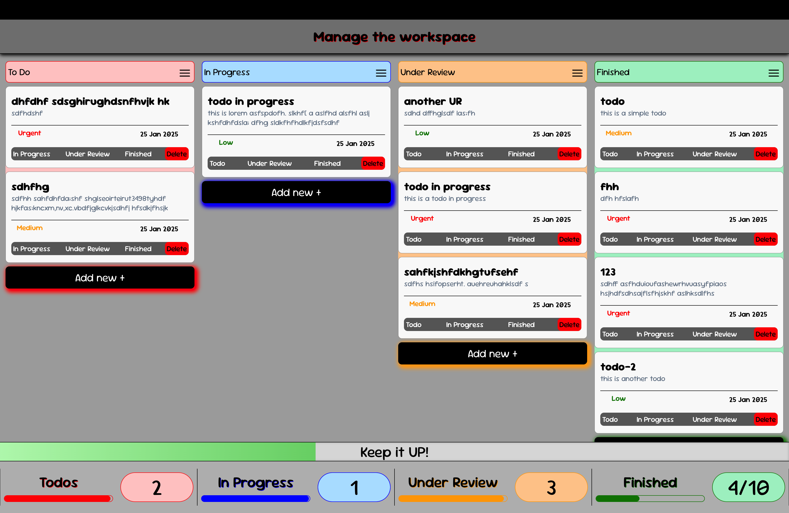

# To-Do List Application

## Overview

This project is a simple and interactive **To-Do List Application**, built using **HTML**, **CSS**, and **JavaScript**. It demonstrates advanced DOM manipulation techniques to create a dynamic and user-friendly experience.

## Features

- Add new tasks
- Mark tasks as completed
- Delete tasks
- Responsive and clean UI

## Technologies Used

- **HTML**: Structure of the application
- **CSS**: Styling for a visually appealing layout
- **JavaScript**: Logic and DOM manipulation

## How to Run the Project

1. Clone the repository:

   ```bash
   git clone https://github.com/yourusername/Todo.git
   ```

2. Navigate to the project directory:

   ```bash
   cd Todo
   ```

3. Open the `index.html` file in your browser:

   ```
   http://127.0.0.1:5500/Todo/index.html
   ```

## Screenshots



## Learnings

- Gained hands-on experience with advanced DOM manipulation techniques
- Improved skills in JavaScript programming
- Enhanced understanding of building responsive layouts with CSS

## Contributing

Feel free to fork this repository and submit pull requests for any improvements or new features!

## Feedback

I’d love to hear your feedback! Reach out to me on [LinkedIn](https://linkedin.com/in/yourprofile) or [Twitter](https://twitter.com/yourhandle).

## License

This project is licensed under the [MIT License](LICENSE).
